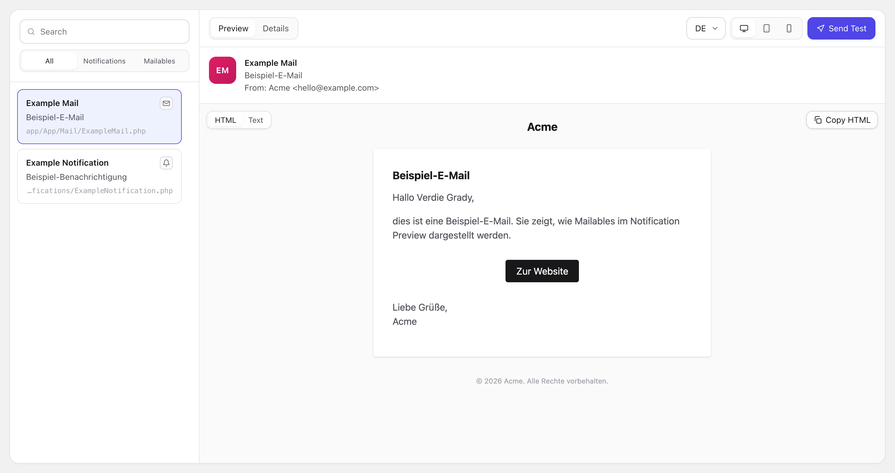

# Laravel Notification Viewer

Browse, preview and test-send every notification and mailable in your Laravel app.

The viewer scans the configured directories, builds each class by resolving its
constructor arguments from their types, and renders the mail it produces. Classes
whose arguments reflection cannot guess get their data from resolvers or
variants you register.



## Installation

```bash
composer require pxlrbt/laravel-notification-viewer --dev
php artisan vendor:publish --tag=notification-viewer-config
```

The viewer registers its routes automatically and is **always disabled in the
production environment**.

## Configuration

```php
// config/notification-viewer.php
return [
    'enabled' => env('NOTIFICATION_VIEWER_ENABLED', true),

    // The kinds of classes to look for. Turn either off to skip it entirely.
    'notifications' => env('NOTIFICATION_VIEWER_NOTIFICATIONS', true),
    'mailables' => env('NOTIFICATION_VIEWER_MAILABLES', true),

    'url_prefix' => env('NOTIFICATION_VIEWER_URL_PREFIX', 'dev/notifications'),
    'middleware' => ['web'],

    // Directories, scanned recursively.
    'paths' => [
        app_path('Notifications'),
        app_path('Mail'),
    ],

    // Class names and namespaces to hide.
    'exclude' => [],

    // null falls back to the directories inside lang_path()
    'locales' => null,

    'test_email' => env('NOTIFICATION_VIEWER_TEST_EMAIL'),
];
```

The namespace of each directory is read from Composer's PSR-4 map, so it never
has to be repeated here. Directories that map to nothing are skipped.

Only concrete subclasses of `Illuminate\Notifications\Notification` and
`Illuminate\Mail\Mailable` are listed; abstract classes and everything else are
skipped. That means you can point `paths` at a whole domain directory without
filtering it yourself.

Mailables are handled the same way as notifications throughout — both styles
(`envelope()`/`content()` and the older `build()`) report their subject, sender
and template.

The preview has an HTML/Text switch. The text side renders the plain-text
alternative the mail channel would send: a `->text()` view when there is one,
otherwise the markdown template rendered through the text components. Messages
built from a single HTML view have no text part and say so.

### Hiding classes

`exclude` takes fully qualified class names and namespaces. A namespace hides
everything below it:

```php
'exclude' => [
    App\Notifications\Internal\DebugPing::class,   // one class
    'App\Notifications\Internal',                  // the whole namespace
],
```

## Argument resolution

For each constructor parameter the viewer tries, in order:

1. A value edited in the UI (scalars, enums and dates only).
2. A registered resolver for the parameter reference, then for its type.
3. The parameter's default value.
4. A value derived from the type — enums use their first case, dates use `now()`,
   models use `Model::factory()->make()` and fall back to `Model::query()->first()`,
   collections come back empty, anything else is resolved from the container.
5. A faked scalar derived from the parameter name — `$email`, `$url`, `$name` and
   `$*Id` get plausible values, everything else gets `'Sample text'`.

## Supplying your own data

### Resolvers

Register these in a service provider, keyed by type:

```php
use pxlrbt\LaravelNotificationViewer\Facades\NotificationViewer;

NotificationViewer::resolve(Order::class, fn () => Order::factory()->make(['id' => 1]));
```

Untyped parameters cannot be matched by type, so key them by parameter instead.
A key registered against a parent class covers every subclass:

```php
NotificationViewer::resolve(
    StateNotification::class.'::$model',
    fn () => Order::factory()->make(),
);
```

The notifiable that notifications are rendered against works the same way:

```php
NotificationViewer::notifiable(fn () => User::factory()->make(['id' => 1]));
```

### Variants

When a notification needs more than constructor arguments — setters, a specific
state, a particular payload — register named variants. A variant returns the
finished notification and skips argument resolution entirely:

```php
NotificationViewer::variants(OrderCancelled::class, [
    'By customer' => fn () => (new OrderCancelled($order))->setReason('customer'),
    'By us' => fn () => (new OrderCancelled($order))->setReason('internal'),
]);
```

Variants can pin their own notifiable:

```php
use pxlrbt\LaravelNotificationViewer\Variant;

NotificationViewer::variants(OrderShipped::class, [
    'To the buyer' => Variant::make('To the buyer', fn () => new OrderShipped($order))
        ->notifiable(fn () => User::factory()->make(['id' => 2])),
]);
```

### Variants on the notification itself

If you would rather keep the preview data next to the notification, add a static
`previewVariants()` method. No interface to implement, no import needed:

```php
class OrderShipped extends Notification
{
    public static function previewVariants(): array
    {
        return [
            'Express' => fn () => new self(Order::factory()->express()->make()),
            'Standard' => fn () => new self(Order::factory()->make()),
        ];
    }
}
```

Variants registered through the facade take precedence over these.

### Labels and groups

```php
NotificationViewer::label(OrderShipped::class, 'Shipping confirmation');
NotificationViewer::group(OrderShipped::class, 'Orders');
```

### Registering and excluding classes

```php
NotificationViewer::register(SomePackage\Notifications\Welcome::class);

// Same matching rules as the `exclude` config key.
NotificationViewer::exclude(InternalDebugNotification::class);
NotificationViewer::exclude('App\Notifications\Internal');
```

## Testing

```bash
composer test
composer analyse
composer format
```
